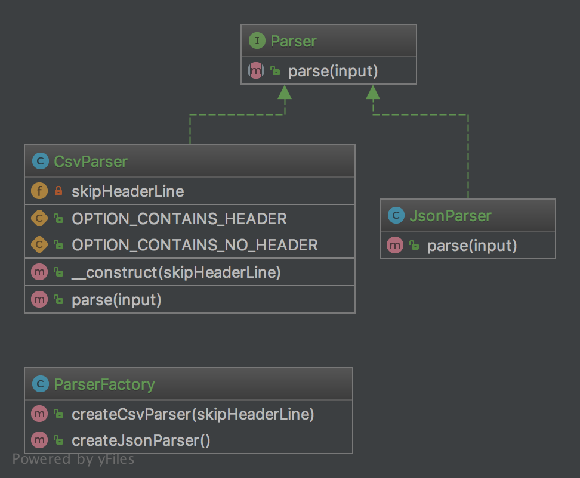

# 抽象工厂模式

## 目的

**为了创建一系列有关联的或依赖的对象而不指定他们的具体类**

**通常被创建的类都继承相同的接口**

**使用抽象工厂时客户端不用关心这些对象是如何创建的，它只知道他们是如何组合在一起的**

## UML图

## 代码

Parser.php  
CsvParser.php  
JsonParser.php  
ParserFactory.php

## 测试

Tests/AbstractFactoryTest.php

## 参考
- https://github.com/domnikl/DesignPatternsPHP/tree/master/Creational/AbstractFactory
- http://en.wikipedia.org/wiki/Abstract_factory_pattern
