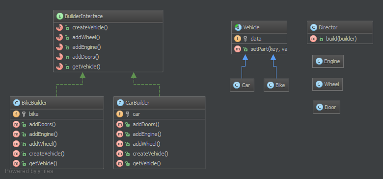

# 构建者模式

## 目的

**构建者模式是一个构建一些复杂对象的接口**

**有时候，如果构建者接口对于要构建什么有更好的了解，这个接口可以是一个带有一些默认方法的抽象类（类似配适器）**

**如果你生成的对象有一个复杂的继承树，那么让你的构建者接口上也有一个复杂的继承树是比较合理的**

> 注意：构建者通常有一个`流式接口`，可参考`PHPUnit`的`mock builder`

## 示例

-  `PHPUnit`: `Mock Builder`

## UML图

## 代码

Director.php  
BuilderInterface.php  
TruckBuilder.php  
CarBuilder.php  
Parts/Vehicle.php  
Parts/Truck.php  
Parts/Car.php  
Parts/Engine.php  
Parts/Wheel.php  
Parts/Door.php  

## 测试

Tests/DirectorTest.php

## 参考

- https://github.com/domnikl/DesignPatternsPHP/tree/master/Creational/Builder
- http://en.wikipedia.org/wiki/Builder_pattern
