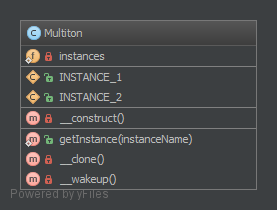

# 多例模式

> 这被认为是一种反面模式！为了更好的测试性和可维护性请使用依赖注入

## 目的

**只为有一系列被命名过的已被使用的实例，类似单例模式但有n个实例**

## 示例
--------

-  2个数据库连接器，例如：1个MySQL，另1个SQLite
-  多个日记器（1个debug日记，1个error日记）

## UML图

## 代码

Multiton.php  

## 测试

MultitonTest.php  

## 参考

- https://github.com/domnikl/DesignPatternsPHP/tree/master/Creational/Multiton
