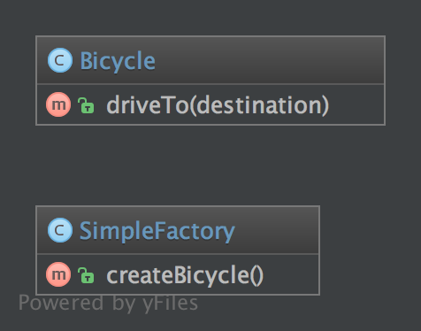

# 简单工厂模式

## 目的

**简单工厂模式是一种简化的工厂模式**

**它不同于静态工厂模式，因为他没有使用static方法**

**因此，您可以拥有多个工厂方法，不同的参数化，您可以将工厂子类化，您可以模拟工厂。它总是应该优先于静态工厂模式！**

## UML图

## 代码

SimpleFactory.php  
Bicycle.php

## 测试

Tests/SimpleFactoryTest.php

## 参考
- https://github.com/domnikl/DesignPatternsPHP/tree/master/Creational/SimpleFactory
