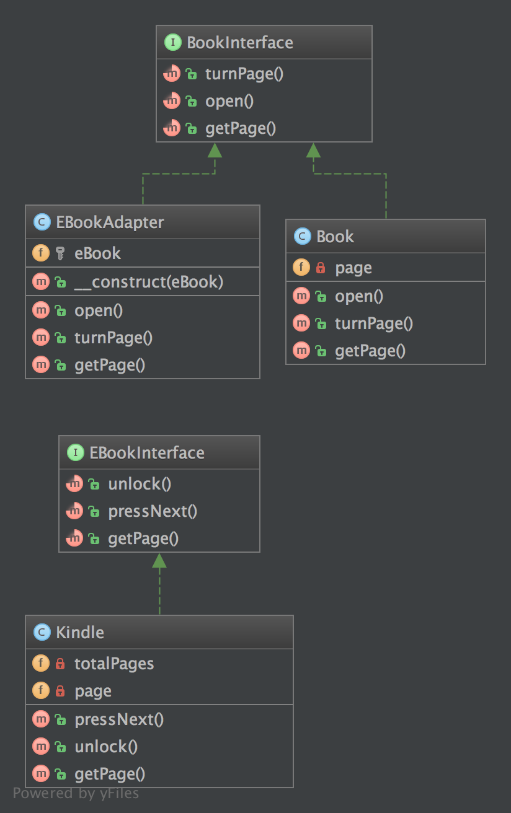

# 适配器模式

## 目的

**将一个类的接口转换为兼容的接口**

**一个适配器让一些本来不能在一起工作的类（因为这些类提供了不兼容的接口）可以在一起工作（通过由适配器自身提供一个兼容接口）**

## 例子

-  数据库客户端配适器
-  使用多个不同的网络服务和适配器规范化数据，使输入结果都相同

## UML图

## 代码

BookInterface.php
Book.php
EBookAdapter.php
EBookInterface.php
Kindle.php

## 测试
Tests/AdapterTest.php

## 参考
- https://github.com/domnikl/DesignPatternsPHP/tree/master/Structural/Adapter
- http://en.wikipedia.org/wiki/Adapter_pattern
